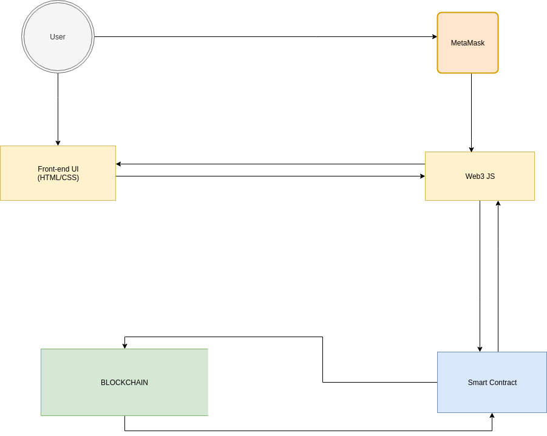

# Code Flow and Structure

The main design decision is to use the ERC721 token standard for Non-Fungible Tokens NFT to model flight seats and boarding passes, which are distributed to passengers upon successful completion of booking and checkin web-flows. ERC721 NFTs enable us to token assets with distinctive characteristics. This token standard is perfectly suited to value-assets like flight seats and boarding passes where each seat has a unique seat number and each boarding pass should be associated with a unique passenger. The benefit of allowing the passenger to hold an ERC721 seat after booking is that it allows the passenger to sell, trade, swap, or give away their seat before checkin, if they wish to.

To implement ERC721 NFTs, the contract FlightSeatsBooker.sol inherits from the OpenZeppelin contract ERC721Token.sol, which is OpenZeppelin's implementation of the ERC721 standard.

## DApp Flow Diagram




## Contract Process Flow Diagram


## Airline Functions:

The ``createFlight()`` and ``addSeatsToClass()`` functions allow the Airline to initiate a flight in contract storage and populate the flight with seat inventory per-cabin. 

FlightIds are constructed by SHA3-hashing the distinctive Flight details of flight-number and departure datetime, and a mapping of ``flightIds`` to ``Flight`` structs is persisted in storage. The benefit of hashing the flight-number/departure-datetime for the ``flightIds`` is that the Flight ID is deterministic and we can calculate the flight ID given any flight-number/departure-date combination. Appropriate-length byte arrays are used to model the flight itinerary details in the ``Flight`` struct to conserve storage space.

The ``createFlight()`` function validates an airline's digital signature which contains the flight id, airline address and nonce to ensure uniqueness.

The ``addSeatsToClass()`` creates ``Seats`` per-cabin. A mapping of ``seatIds`` to ``Seat`` structs is persisted in contract storage. Similar to flightIds - ``seatIds`` are constructed from uniquely identifiable details of the seats to allow for ID re-creation/discovery. Seat IDs are constructed from ``flightNumber``, ``departureDateTime``, ``seatNumber``.

The ERC721 Seat tokens are not minted until a passenger invokes ``bookSeat()``, as we do not want tokens to exist until the seat has been booked.

When passengers book seats the fees are not immediately pushed to the airline. The seat fee is deposited in a storage mapping to allow the airline to pull the fees, for security purposes. The ``withdrawFlightFees()`` function handles airline fee withdrawals. 

## Passenger Functions.


The passenger can invoke the ``bookSeat()`` function from the UI to pay the seat fee and receive a newly-minted ERC721 Seat NFT issued by the airline. When the seats are minted the ERC721 numeric ID for the Seat token is the numeric ``uint256`` representation of the ``bytes32`` seatId hash, allowing for deterministic recreation of token ids based on flightNumber + departureDateTime + seatNumber.

When ERC721 seats are newly minted and sent to the passenger address, the airline address is also set as 'Approved' on the new seat, which means the airline is authorised to transfer this NFT. The ERC721 standard allows for secondary approved operators on the token in addition to the primary token owner. This is important for the airline to retain some degree of control over the ERC721 Seat for the use-case of cancelling a seat-booking, among others.


To checkin for the flight, the passenger invokes the ``checkinBuyer()`` function. The result of this function is that the passengers ERC721 seat will be burned by the airline, and the airline sends the passenger a newly minted ERC721 Boarding Pass NFT. The passenger passes the ``seatId``, ``barcodeString`` and ``passportScanIpfsHash`` to the checkin function. The ``barcodeString`` is retrieved from the contract in the web layer prior to invoking ``checkinBuyer()``, and this barcodeString contains all salient boarding pass information; flightNumber-origin-destination-departureDateTime-seatNumber. The QR-code on the passenger's boarding pass will be a 2D-barcode encoding of this ``barcodeString``.

```javascript
uint256 _boardingPassId = uint256(keccak256(abi.encodePacked(_barcodeString, "_", _passportScanIpfsHash)));
_burn(msg.sender, _seatId); 	// burns the ERC721 Seat
_mint(msg.sender, _boardingPassId);	// mints a new ERC721 Boarding Pass
```

This combination of ``barcodeString`` and ``passportScanIpfs`` unqiuely ties the passenger to this boarding pass, which is itself a ERC721 digital bearer instrument which only the passenger should possess. This provides greater security than current boarding pass implementations. It allows airport security to validate the passport/boarding pass association at the departures lounge entry rather than waiting for the airline to properly check at the departures gate. Currently anybody can mock up a boarding pass image and present at the departures lounge entry.